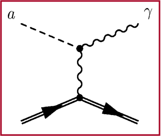
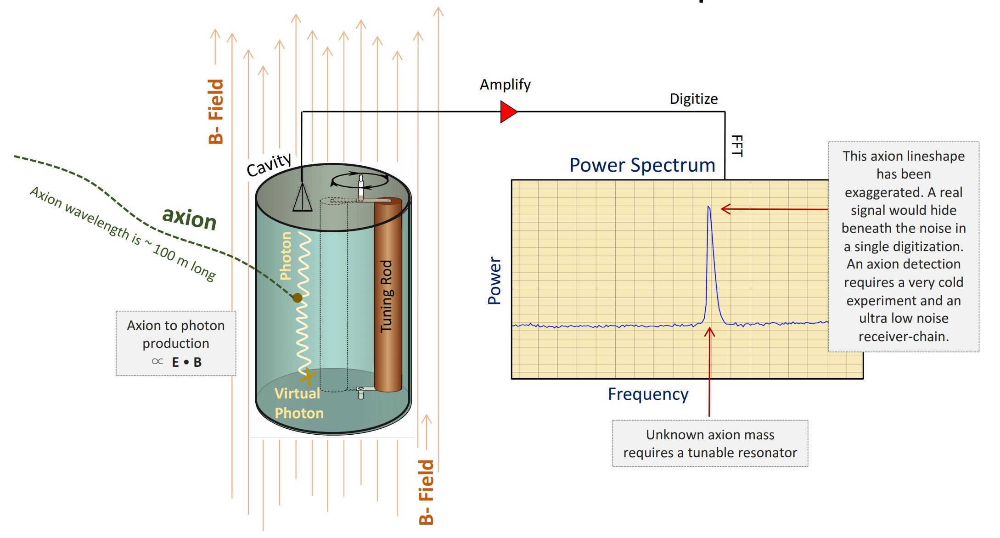
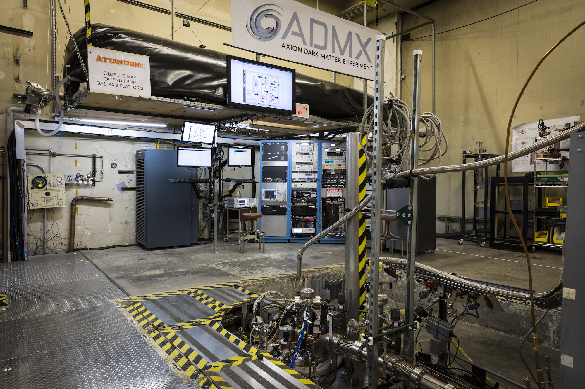

<!--
theme: default
headingDivider: 1
class: invert
header: Axion electrodynamics  
footer: Marc Steiner, 18.05.2020
paginate: true
marp: true
-->

<!--
_class:
 - lead
-->
# Axion electrodynamics

# Overview

* What is an axion
  * Strong CP problem
  * Peccei–Quinn mechanism
  * The axion field
* Axion electrodynamics
* Cosmological considerations
* Experiments

# What is an axion

According to Wikipedia:

> The axion is a hypothetical elementary particle postulated by the Peccei–Quinn theory to resolve the strong CP problem in quantum chromodynamics (QCD).

 

Why are axions interesting?

> If axions exist and have low mass within a specific range, they are of interest as a possible component of cold dark matter.

# CP symmetry

> CP-symmetry states that the laws of physics should be the same if a particle were interchanged with its antiparticle (C symmetry, as charges of antiparticles are the negative of the corresponding particle), and then left and right were swapped (P symmetry).

# Strong CP problem

 

$$
{\mathcal L}_\mathrm{QCD} = -\frac{1}{4} F_{\mu\nu}F^{\mu\nu}-\theta\frac{n_f g^2}{32\pi^2}
F_{\mu\nu}\tilde F^{\mu\nu}+\bar \psi(i\gamma^\mu D_\mu - m
e^{i\theta'\gamma_5})\psi
$$

 

Contains a CP symmetry violating term:

$$
L_{\theta} = \theta\frac{n_f g^2}{32\pi^2}
F_{\mu\nu}\tilde F^{\mu\nu}
$$

# Strong CP problem
## Neutron electric dipole moment

* CP symmetry violation leads to a electric dipole moment for the neutron
* So far not measured and can only be very tiny
* Therefore CP violation and $\theta$ has to be tiny as well ( $< 10^{-10} \space rad$ )
* Poses a "naturalness" problem
* Natural theories have free parameters ($\theta$ in QCD) of the order $1$
* $\theta$ should be $\approx 1$ and not $\approx 10^{-10}$
 
# Strong CP problem
##  Massless quarks

* Even one massless quark type would render CP violation unobservable
* However empirical evidence strongly suggest that none of the quarks are massless
* Other explanations?

# Peccei–Quinn mechanism

* Postulated by Helen Quinn and Roberto Peccei
* Promote the $\theta$ parameter to a dynamic field
* The potential of this field cancels its value  
* $\theta$ becomes zero uneventfully, naturally resolving the strong CP problem 

# The axion field

* Th symmetry introduced by Quinn and Peccei is spontaneously broken by the vacuum expectation value of $\theta$
* The axion arises as massless Nambu-Goldstone boson of this broken symmetry according to Goldstone's theorem
* First postulated independently by Frank Wilczek and Steven Weinberg
* Named by Frank Wilczek after the laundry detergent axion

# The axion field

$$
L_{\theta} = \theta\frac{n_f g^2}{32\pi^2}
F_{\mu\nu}\tilde F^{\mu\nu} \implies L_a = \frac{a}{f_a}\frac{n_f g^2}{32\pi^2}
F_{\mu\nu}\tilde F^{\mu\nu}
$$

# Possible axion models

* Original Wilczek/Weinberg axion ruled out
* Properties depend on the vacuum expectation value $f_a$ of $\theta$
* Axion mass and its coupling are inversely proportional to $f_a$
* $f_a$ can be arbitrary with regard to resolving the strong CP problem
* From experiments and theoretical considerations: $f_a \gt 10^8 GeV$
* Axions have been called "invisible"

# Axion

* Symbol: $A^0$
* No electric charge and no spin
* Mass between $10^{-5}$ to $10^{-3}$ $\frac{eV}{c^2}$
* Interacts only gravitationally and electromagnetically
* Very weak interaction
* Good candidate for dark matter, due to its mass and weak interaction

# Axion electrodynamics

* Pierre Sikivie postulated a modification of Maxwell's equations including the interaction with axions
* Proposed multiple experiments to measure them
* All rely on axion $\Leftrightarrow$ photon conversion in the presence of strong magnetic fields

# Axion electrodynamics
## Modified Maxwell's equations

| Name          | Equation      | 
| ------------- |:-------------:|
| Gauss' law    | $\nabla \cdot (\mathbf{E} - \kappa \theta c \mathbf{B}) = \frac {\rho_e} {\varepsilon_0}$ |
| Gauss's law for magnetism   | $\nabla \cdot (c \mathbf{B} + \kappa \theta \mathbf{E}) = 0$      |
| Faraday's law | $\nabla \times (\mathbf{E} - \kappa \theta c \mathbf{B}) = -\partial_{ct} ( c \mathbf{B} + \kappa \theta \mathbf{E} )$ |
| Ampère's law | $\nabla \times ( c \mathbf{B} + \kappa \theta \mathbf{E}) = \partial_{ct} ( \mathbf{E} - \kappa \theta c \mathbf{B} ) + c \mu_0 \mathbf{J}_e$ |
| Axion law | $( \Box + m_a^2) \theta = -\kappa \mathbf{E} \cdot \mathbf{B}$ |

# Axion electrodynamics
## Rotating $\bold{E}$ and $\bold{B}$ into one another

 

${\displaystyle {\begin{bmatrix}\mathbf {E'} \\c\mathbf {B'} \\\end{bmatrix}}={\frac {1}{\cos \xi }}{\begin{bmatrix}\cos \xi &\sin \xi \\-\sin \xi &\cos \xi \\\end{bmatrix}}{\begin{bmatrix}\mathbf {E} \\c\mathbf {B} \\\end{bmatrix}}} \space\space\space\space\space\space\space\space\space\space$ with $\space\space\space\space\space\space\space\space\space\space\tan \xi = \tan(-\kappa \theta)$

# Axion electrodynamics
## Photon $\Leftrightarrow$ Axion conversion

# Cosmological considerations

* Axions might have played a critical role in galaxy formation, through axionic domain walls
* Axions might be dark matter halos around galaxies
* Axions might be created by the Primakoff effect
* Axions might be produced inside the sun

# Experiments

Sikivie proposed essentially two types of possible experiments:

* The axion haloscope
* The axion helioscope

# Experiments
## The axion haloscope

* Way to measure axions coming from the dark matter halo around our local galaxy
* Microwave cavity has to be resonantly tuned to the mass of the axion
* Dynamical cavity length to probe for different possible masses
* Noise reduction is important
* The magnetic field has to be inhomogeneous
* Inhomogeneity can be achieved by embedding wires of a superconducting metal in a material transparent to microwave radiation and cooling down to the critical temperature

---

# Experiments
## The axion helioscope

* Same principle as the haloscope but for solar axions
* Solar axions are expected to be produced in the sun due to the Primakoff effect
* Solar axions convert to X-rays in the presence of strong magnetic fields

---

# Current experiments

* Axion Dark Matter Experiment (ADMX)
  * Haloscope
  * Sited at the CENPA at the University of Washington
  * Large collaborative effort
* CERN Axion Solar Telescope (CAST)
  * Helioscope
  * Sited at CERN in Switzerland
* The International Axion Observatory (IAXO)
  * Successor to CAST
* Other experiments like PLVAS that build on other theoretical hypotheses

---

# Summary

* The axion is a hypothetical particle that appears as a solution to the strong CP problem, namely the Peccei-Quinn mechanism
* It is neutral and very light (but not massless)
* It interacts only very weakly with conventional matter
* It could transform into a photon (and viceversa) in the presence of a magnetic field (Axion electrodynamics)
* Excitingly, it could also be a very natural solution to the problem of dark matter, essentially killing two birds with one stone

# Further readings

The Strong CP Problem and Axions (R. D. Peccei):
http://arxiv.org/pdf/hep-ph/0607268.pdf

QCD, Strong CP and Axions (R. D. Peccei):
https://cds.cern.ch/record/306320/files/9606475.pdf

Experimental Tests of the "Invisible" Axion (P. Sikivie):
https://sci-hub.tw/10.1103/physrevlett.51.1415

Symmetries in physics (N. Beisert):
http://edu.itp.phys.ethz.ch/hs15/sym/SymHS15Notes.pdf

Symmetry and symmetry breaking in particle physics (Tsou Sheung Tsun):
https://cds.cern.ch/record/349544/files/9803159.pdf

